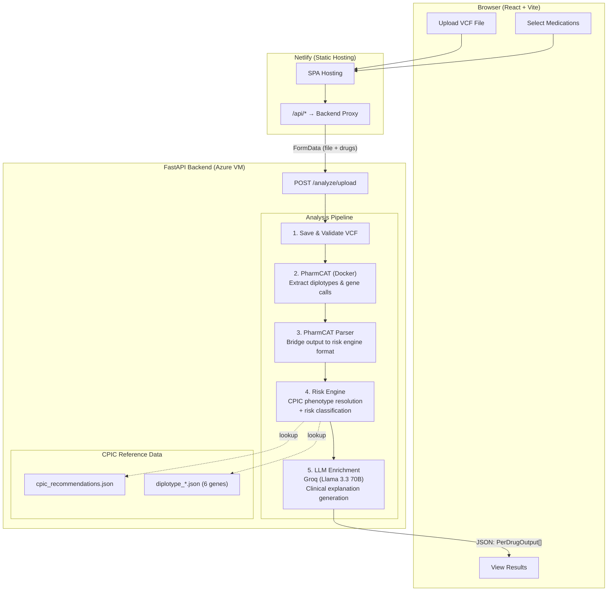
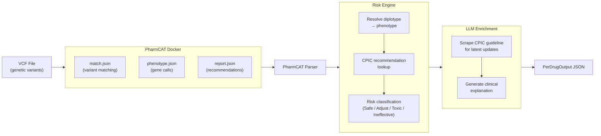
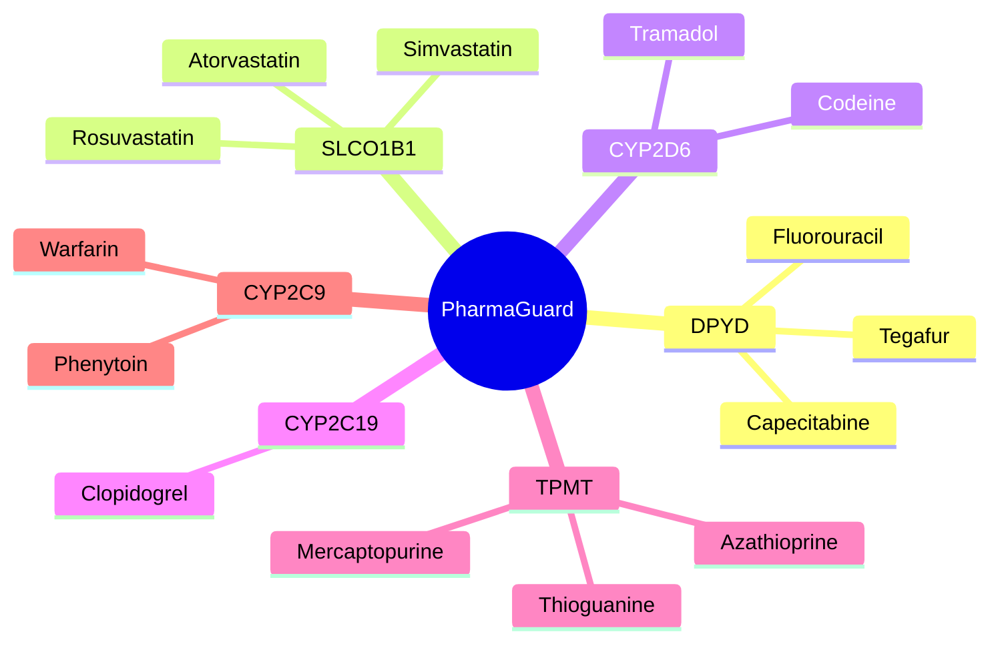
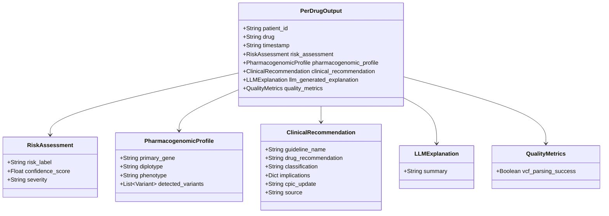

# PharmaGuard

**Pharmacogenomic Risk Assessment Platform**

[](https://pharmaguard-tbo.netlify.app/)
&nbsp;
[](YOUR_LINKEDIN_VIDEO_URL_HERE)

---

## Table of Contents

- [What is PharmaGuard?](#what-is-pharmaguard)
- [The Problem](#the-problem)
- [How It Works](#how-it-works)
- [Architecture Overview](#architecture-overview)
- [Tech Stack](#tech-stack)
- [Supported Genes and Drugs](#supported-genes-and-drugs)
- [Installation](#installation)
- [API Documentation](#api-documentation)
- [Usage](#usage)
- [Project Structure](#project-structure)
- [Team](#team)

---

## What is PharmaGuard?

PharmaGuard is a web application that helps clinicians make safer prescribing decisions by analyzing a patient's genetic data against established pharmacogenomic guidelines.

A clinician uploads a patient's **VCF file** (the standard output from genetic sequencing), selects the medications they want to evaluate, and PharmaGuard returns a report that classifies each drug into one of three categories: **safe to use**, **requires dosage adjustment**, or **should be avoided** — all based on the patient's actual genetic variants, not population averages.

The platform analyzes **6 pharmacogenes** (CYP2D6, CYP2C19, CYP2C9, SLCO1B1, TPMT, DPYD) across **14 medications** where genetic variation has clinically significant effects on drug response. Every recommendation is traced back to [CPIC guidelines](https://cpicpgx.org/) (Clinical Pharmacogenetics Implementation Consortium), the gold standard for pharmacogenomic prescribing.

---

## The Problem

Adverse drug reactions cause **over 100,000 deaths per year** in the US alone ([Lazarou et al., JAMA](https://jamanetwork.com/journals/jama/article-abstract/187436)). Many of these reactions are predictable from a patient's genetics, but most prescribers don't have easy access to pharmacogenomic interpretation tools.

Existing workflows require:
1. Sending genetic data to a specialized lab
2. Waiting days/weeks for interpretation
3. Manually cross-referencing results against CPIC guideline tables

PharmaGuard collapses this into a single upload-and-analyze workflow that returns actionable results in under a minute.

---

## How It Works

```
Patient VCF File ──► PharmaGuard ──► Genotype-Guided Prescribing Report
```

**Step-by-step breakdown:**

| Step | What Happens | Where |
|------|-------------|-------|
| 1 | Clinician uploads a `.vcf` file and selects drugs to evaluate | Frontend |
| 2 | VCF file is sent to the backend along with the drug list | API call |
| 3 | [PharmCAT](https://pharmcat.org/) (an NIH-funded tool) extracts diplotypes and gene calls from the VCF | Backend (Docker) |
| 4 | The risk engine resolves each diplotype to a phenotype (e.g., *Poor Metabolizer*) using CPIC lookup tables | Backend |
| 5 | Each drug is classified by risk level: **Safe**, **Adjust Dosage**, **Toxic**, or **Ineffective** | Backend |
| 6 | An LLM (Llama 3.3 70B via Groq) generates a plain-English clinical explanation for each result | Backend |
| 7 | Results are displayed as interactive risk cards, expandable drug details, a phenotype prediction grid, and a clinical evidence table | Frontend |
| 8 | Clinician can export the full report as JSON | Frontend |

---

## Architecture Overview



### Data Flow Detail



---

## Tech Stack

| Layer | Technology | Purpose |
|-------|-----------|---------|
| **Frontend** | React 19, Vite 7 | UI framework and build tool |
| **Animations** | Framer Motion 12 | Smooth transitions and progress animations |
| **Styling** | CSS (component-scoped) | One `.css` file per component |
| **Backend** | Python, FastAPI, Uvicorn | REST API server |
| **Validation** | Pydantic v2 | Request/response schema enforcement |
| **PGx Analysis** | PharmCAT (Docker) | NIH-funded pharmacogenomic annotation |
| **Clinical Data** | CPIC Guidelines (JSON) | Gold-standard prescribing recommendations |
| **LLM** | Groq API → Llama 3.3 70B | Clinical explanation generation |
| **Web Scraping** | BeautifulSoup4, Requests | CPIC guideline update extraction |
| **Frontend Hosting** | Netlify | Static site + API proxy |
| **Backend Hosting** | Azure VM | FastAPI server with Docker |

---

## Supported Genes and Drugs

PharmaGuard analyzes 6 pharmacogenes that have well-established, clinically actionable drug interactions per CPIC guidelines:



### Why These Genes?

| Gene | What It Affects | Clinical Impact of Variants |
|------|----------------|---------------------------|
| **DPYD** | Metabolism of fluoropyrimidine chemotherapy drugs | Poor metabolizers can experience **life-threatening toxicity** from standard doses |
| **SLCO1B1** | Hepatic uptake of statins | Reduced function variants increase risk of **myopathy and rhabdomyolysis** |
| **CYP2D6** | Metabolism of codeine, tramadol (and ~25% of all drugs) | Poor metabolizers get **no pain relief** from codeine; ultrarapid metabolizers risk **respiratory depression** |
| **CYP2C19** | Activation of clopidogrel (antiplatelet) | Poor metabolizers **cannot activate clopidogrel**, leading to treatment failure and potential **stroke/heart attack** |
| **TPMT** | Metabolism of thiopurine immunosuppressants | Poor metabolizers accumulate toxic metabolites → **severe bone marrow suppression** |
| **CYP2C9** | Metabolism of warfarin, phenytoin | Poor metabolizers need **significantly lower doses** to avoid bleeding (warfarin) or toxicity (phenytoin) |

### Phenotype Classification

Each gene result is classified into a metabolizer phenotype:

| Abbreviation | Phenotype | Meaning |
|-------------|-----------|---------|
| **NM** | Normal Metabolizer | Standard drug response expected |
| **IM** | Intermediate Metabolizer | Reduced enzyme activity; dose adjustment may be needed |
| **PM** | Poor Metabolizer | Very low/no enzyme activity; significant dose reduction or drug avoidance |
| **RM** | Rapid Metabolizer | Increased enzyme activity |
| **URM** | Ultrarapid Metabolizer | Very high enzyme activity; drug may be cleared too quickly or over-activated |

---

## Installation

### Prerequisites

| Requirement | Version | Purpose |
|------------|---------|---------|
| Python | 3.10+ | Backend runtime |
| Node.js | 18+ | Frontend build tool |
| Docker | Any recent version | PharmCAT genotype caller |
| Groq API Key | — | LLM clinical explanations |

### 1. Clone the Repository

```bash
git clone https://github.com/sankalp-happy/Rift2k26.git
cd Rift2k26
```

### 2. Backend Setup

```bash
cd backend

# Create and activate a virtual environment
python -m venv .venv
source .venv/bin/activate        # macOS / Linux
# .venv\Scripts\activate         # Windows

# Install dependencies
pip install -r requirements.txt

# Create environment file
echo "GROQ_API_KEY=your_groq_api_key_here" > .env
```

Get a Groq API key (free tier available): [https://console.groq.com/keys](https://console.groq.com/keys)

```bash
# Pull the PharmCAT Docker image (required for VCF analysis)
docker pull pgkb/pharmcat

# Start the backend server
uvicorn main:app --host 0.0.0.0 --port 8080 --reload
```

The backend will be available at `http://localhost:8080`. Verify with:

```bash
curl http://localhost:8080/health
# Expected: {"status":"ok","supported_drugs":["fluorouracil","capecitabine",...]}
```

### 3. Frontend Setup

```bash
cd frontend

# Install dependencies
npm install

# Start the development server
npm run dev
```

The frontend will be available at `http://localhost:5173`.

### 4. Connect Frontend to Backend (Local Development)

The frontend proxies `/api/*` requests. For local development, update [frontend/vite.config.js](frontend/vite.config.js) to proxy to your local backend:

```js
export default defineConfig({
  plugins: [react()],
  server: {
    proxy: {
      '/api': {
        target: 'http://localhost:8080',
        changeOrigin: true,
        rewrite: (path) => path.replace(/^\/api/, ''),
      },
    },
  },
});
```

---

## API Documentation

### Base URL

| Environment | URL |
|------------|-----|
| Production | `https://pharmaguard-tbo.netlify.app/api` (proxied to backend) |
| Local | `http://localhost:8080` |

### Endpoints

#### `GET /health`

Returns server status and the list of supported drugs.

**Response:**
```json
{
  "status": "ok",
  "supported_drugs": [
    "fluorouracil", "capecitabine", "tegafur",
    "simvastatin", "atorvastatin", "rosuvastatin",
    "codeine", "tramadol",
    "clopidogrel",
    "azathioprine", "mercaptopurine", "thioguanine",
    "warfarin", "phenytoin"
  ]
}
```

---

#### `POST /analyze/upload`

Analyzes a VCF file against selected drugs and returns pharmacogenomic risk assessments.

**Request:** `multipart/form-data`

| Field | Type | Description |
|-------|------|-------------|
| `file` | File | `.vcf` file (VCF 4.x format, hg38 reference genome) |
| `drugs` | String | JSON array of drug names, e.g., `'["warfarin","clopidogrel"]'` |

**Example:**
```bash
curl -X POST http://localhost:8080/analyze/upload \
  -F "file=@patient_sample.vcf" \
  -F 'drugs=["warfarin","clopidogrel","simvastatin"]'
```

**Response:** `200 OK` — Array of `PerDrugOutput` objects:

```json
[
  {
    "patient_id": "SAMPLE1",
    "drug": "warfarin",
    "timestamp": "2026-02-20T10:30:00Z",
    "risk_assessment": {
      "risk_label": "Adjust Dosage",
      "confidence_score": 1.0,
      "severity": "low/moderate"
    },
    "pharmacogenomic_profile": {
      "primary_gene": "CYP2C9",
      "diplotype": "*1/*2",
      "phenotype": "IM",
      "detected_variants": [
        { "rsid": "rs1799853" }
      ]
    },
    "clinical_recommendation": {
      "guideline_name": "CPIC Guideline for Pharmacogenetics-Guided Warfarin Dosing",
      "drug_recommendation": "Consider reduced initial dose based on CYP2C9 genotype.",
      "classification": "Strong",
      "implications": {
        "CYP2C9": "Reduced warfarin clearance, lower dose requirements"
      },
      "cpic_update": "No significant updates since last publication.",
      "source": "scraped"
    },
    "llm_generated_explanation": {
      "summary": "This patient carries a CYP2C9 *1/*2 diplotype, classified as an Intermediate Metabolizer. CYP2C9 is responsible for metabolizing warfarin. With reduced enzyme activity, warfarin is cleared more slowly, leading to higher drug levels at standard doses. CPIC guidelines recommend starting at a lower dose and monitoring INR closely."
    },
    "quality_metrics": {
      "vcf_parsing_success": true
    }
  }
]
```

### Response Schema Reference



**Field Details:**

| Field | Values | Description |
|-------|--------|-------------|
| `risk_label` | `Safe`, `Adjust Dosage`, `Toxic`, `Ineffective`, `Unknown` | Overall prescribing risk classification |
| `confidence_score` | `0.0` – `1.0` | `1.0` = Strong CPIC evidence, `0.75` = Moderate, `0.0` = no matching guideline |
| `severity` | `none`, `low/moderate`, `high`, `critical` | Clinical severity of the interaction |
| `phenotype` | `NM`, `IM`, `PM`, `RM`, `URM`, `Unknown` | Metabolizer status derived from diplotype |
| `classification` | `Strong`, `Moderate`, `No Recommendation` | CPIC evidence level for the recommendation |
| `source` | `scraped`, `llm_fallback_no_url`, `llm_fallback_scrape_failed` | How the clinical explanation was generated |

**Error Responses:**

| Status | Cause |
|--------|-------|
| `400` | Invalid file format (not `.vcf`) |
| `422` | Invalid drug names or malformed request |
| `500` | PharmCAT pipeline failure or internal error |
| `504` | Analysis timed out (> 5 minutes) |

---

## Usage

### Web Interface Walkthrough

**Step 1 — Upload VCF File**

Drag and drop a `.vcf` file onto the upload area, or click to browse. The interface validates the file format and shows variant count estimates.

```
┌─────────────────────────────────────────────────────────┐
│                                                         │
│       ┌───────────────────────────────────────┐         │
│       │                                       │         │
│       │     Drag & drop your VCF file here    │         │
│       │         or click to browse            │         │
│       │                                       │         │
│       │     Accepted: .vcf (VCF 4.x)         │         │
│       └───────────────────────────────────────┘         │
│                                                         │
│   ✓ sample_hg38.vcf (2.3 MB, ~45,000 variants)         │
│                                                         │
└─────────────────────────────────────────────────────────┘
```

**Step 2 — Select Medications**

Search and select drugs from the dropdown. You can type to filter, paste a comma-separated list, or click "Select all".

```
┌─────────────────────────────────────────────────────────┐
│  Selected: [warfarin ×] [clopidogrel ×] [simvastatin ×] │
│                                                         │
│  ┌─────────────────────┐                                │
│  │ Search drugs...     │   Select all  |  Clear all     │
│  ├─────────────────────┤                                │
│  │ atorvastatin        │                                │
│  │ azathioprine        │                                │
│  │ capecitabine        │                                │
│  │ codeine             │                                │
│  │ ...                 │                                │
│  └─────────────────────┘                                │
│                                  [ Analyze → ]          │
└─────────────────────────────────────────────────────────┘
```

**Step 3 — Analysis Progress**

After clicking Analyze, an 8-step progress animation shows the pipeline stages:

```
┌─────────────────────────────────────────────────────────┐
│  ✓ Uploading VCF file                                   │
│  ✓ Validating genetic data                              │
│  ✓ Running PharmCAT annotation                          │
│  ◉ Resolving diplotypes...                              │
│  ○ Looking up CPIC recommendations                      │
│  ○ Classifying drug risks                               │
│  ○ Generating clinical explanations                     │
│  ○ Compiling report                                     │
└─────────────────────────────────────────────────────────┘
```

**Step 4 — Review Results**

Results are displayed in four sections:

**Risk Summary** — Color-coded cards grouping drugs by risk tier:

```
┌──────────────┐  ┌──────────────┐  ┌──────────────┐
│  🔴 AVOID    │  │  🟡 CAUTION  │  │  🟢 ROUTINE  │
│              │  │              │  │              │
│  (none)      │  │  warfarin    │  │  simvastatin │
│              │  │  clopidogrel │  │              │
└──────────────┘  └──────────────┘  └──────────────┘
```

**Drug Detail Accordion** — Expandable panels with per-drug analysis:

```
┌─────────────────────────────────────────────────────────┐
│ ▼ Warfarin                          Adjust Dosage  🟡   │
│ ─────────────────────────────────────────────────────── │
│ Gene: CYP2C9          Diplotype: *1/*2                  │
│ Phenotype: Intermediate Metabolizer                     │
│ Confidence: 100%      Evidence: Strong (CPIC)           │
│                                                         │
│ Clinical Summary:                                       │
│ This patient carries a CYP2C9 *1/*2 diplotype...        │
│                                                         │
│ Recommendation:                                         │
│ Consider reduced initial dose based on CYP2C9 genotype. │
└─────────────────────────────────────────────────────────┘
│ ► Clopidogrel                                           │
│ ► Simvastatin                                           │
```

**Phenotype Prediction Grid** — Four-axis prediction for each drug:

```
┌──────────────┬───────────┬─────────┬──────────┬────────────┐
│ Drug         │ Toxicity  │ Dosage  │ Efficacy │ Metabolism │
├──────────────┼───────────┼─────────┼──────────┼────────────┤
│ Warfarin     │ ↑         │ ↓       │ ◎        │ ↓          │
│ Clopidogrel  │ ◎         │ ◎       │ ↓        │ ↓          │
│ Simvastatin  │ ◎         │ ◎       │ ◎        │ ◎          │
└──────────────┴───────────┴─────────┴──────────┴────────────┘
  ◎ Normal   ↑ Increased   ↓ Decreased   — N/A
```

**Clinical Annotations Table** — Sortable evidence table with gene, variant, diplotype, evidence level, and source for each finding.

**Step 5 — Export**

A sticky bottom bar provides three export options:
- **View JSON** — Modal preview of the full API response
- **Download JSON** — Saves the report to a `.json` file
- **Copy to Clipboard** — Copies the JSON to clipboard

### Direct API Usage (curl)

```bash
# Check server health and supported drugs
curl http://localhost:8080/health

# Analyze a VCF file for warfarin and clopidogrel
curl -X POST http://localhost:8080/analyze/upload \
  -F "file=@path/to/patient.vcf" \
  -F 'drugs=["warfarin","clopidogrel"]' \
  -o report.json

# Pretty-print the result
cat report.json | python -m json.tool
```

---

## Project Structure

```
Rift2k26/
├── README.md
├── .gitignore
│
├── backend/
│   ├── main.py                    # FastAPI server — /health, /analyze/upload endpoints
│   ├── pharmcat_parser.py         # Parses PharmCAT Docker output (phenotype.json, report.json)
│   ├── risk_engine.py             # CPIC-based phenotype resolution + risk classification
│   ├── generate_result_fn.py      # LLM enrichment — CPIC scraping + Groq explanation generation
│   ├── generate_result_app.py     # Standalone LLM enrichment server (port 8001)
│   ├── requirements.txt           # Python dependencies
│   └── data/
│       ├── cpic_recommendations.json       # CPIC prescribing recommendations (all drugs)
│       ├── diplotype_CYP2C19.json          # CYP2C19 diplotype → phenotype lookup
│       ├── diplotype_CYP2C9.json           # CYP2C9 diplotype → phenotype lookup
│       ├── diplotype_CYP2D6.json           # CYP2D6 diplotype → phenotype lookup
│       ├── diplotype_DPYD.json             # DPYD diplotype → phenotype lookup
│       ├── diplotype_SLCO1B1.json          # SLCO1B1 diplotype → phenotype lookup
│       └── diplotype_TPMT.json             # TPMT diplotype → phenotype lookup
│
└── frontend/
    ├── index.html                 # Entry HTML (Vite)
    ├── package.json               # Node dependencies
    ├── vite.config.js             # Vite build configuration
    ├── eslint.config.js           # Linter configuration
    ├── public/
    │   └── _redirects             # Netlify proxy rules (/api/* → backend)
    └── src/
        ├── main.jsx               # React entry point
        ├── App.jsx                # Root component — state management, API integration, step flow
        ├── App.css                # Global app styles
        ├── index.css              # Base CSS reset
        ├── data/
        │   └── mockData.js        # Development mock data (58 drugs, sample diplotypes)
        └── components/
            ├── Sidebar.jsx        # Left sidebar — branding, 3-step progress, section quick-links
            ├── Sidebar.css
            ├── FileUpload.jsx     # VCF file upload — drag-and-drop, validation, size warnings
            ├── FileUpload.css
            ├── DrugInput.jsx      # Drug selection — searchable multi-select with keyboard nav
            ├── DrugInput.css
            ├── RiskSummary.jsx    # 3-tier risk cards (Avoid / Caution / Routine)
            ├── RiskSummary.css
            ├── DrugDetailAccordion.jsx  # Expandable per-drug analysis panels
            ├── DrugDetailAccordion.css
            ├── PhenotypeGrid.jsx  # 4-axis prediction table (Toxicity/Dosage/Efficacy/Metabolism)
            ├── PhenotypeGrid.css
            ├── ClinicalAnnotations.jsx  # Sortable evidence table
            ├── ClinicalAnnotations.css
            ├── ErrorBanner.jsx    # Animated error/warning notifications
            ├── ErrorBanner.css
            ├── ExportBar.jsx      # Sticky export bar (View/Download/Copy JSON)
            └── ExportBar.css
```

---

## Risk Classification Logic

The risk engine uses deterministic rules based on CPIC recommendation text:

```mermaid
flowchart TD
    Input["Drug + Diplotype"] --> Resolve["Resolve diplotype → phenotype\n(CPIC lookup tables)"]
    Resolve --> Match["Match against CPIC\nrecommendation database"]

    Match --> HasRec{Recommendation\nfound?}

    HasRec -->|No| Unknown["Unknown\n(confidence: 0.0)"]
    HasRec -->|Yes| Parse["Parse recommendation text"]

    Parse --> Contains{"Recommendation\ncontains..."}

    Contains -->|"avoid" or\n"contraindicated"| CheckCodeine{"Is it codeine\n+ Poor Metabolizer?"}
    CheckCodeine -->|Yes| Ineffective["Ineffective\n(no therapeutic effect)"]
    CheckCodeine -->|No| Toxic["Toxic\n(severity: critical)"]

    Contains -->|"reduce dose" or\n"lower dose"| AdjustDose["Adjust Dosage\n(severity: low/moderate)"]

    Contains -->|"alternative statin"| ToxicStatin["Toxic\n(myopathy risk)"]

    Contains -->|"standard" or\n"label recommended"| Safe["Safe\n(severity: none)"]
```

---

## Team

| Name | GitHub |
|------|--------|
| Sankalp Shankar | [@sankalp-happy](https://github.com/sankalp-happy) |
| Ojaswit Sharma | [@Ojaswitsharma](https://github.com/Ojaswitsharma) |
| Abhishek M | [@abhishek-m-29](https://github.com/abhishek-m-29) |
| Abhijit Singh | [@iatenoodles](https://github.com/iatenoodles) |

---

## License

This project was built for RIFT 2026.
